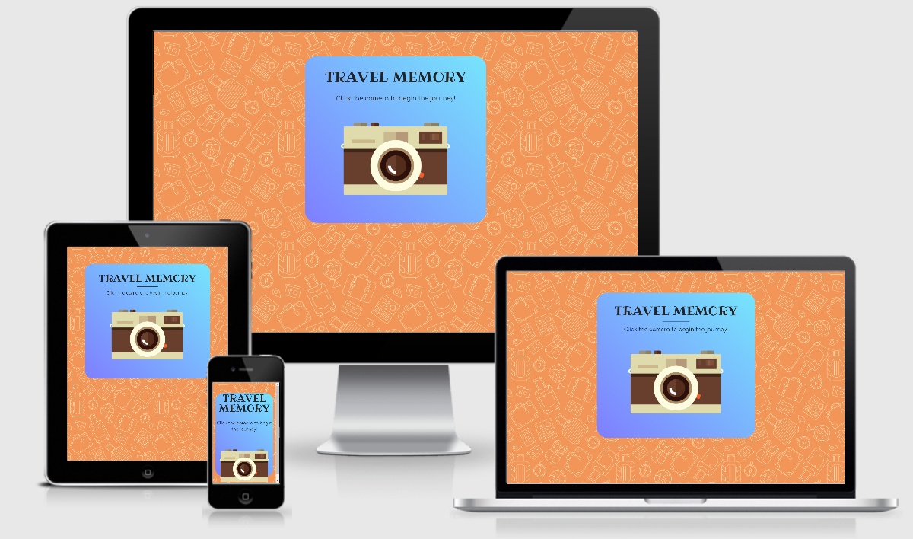
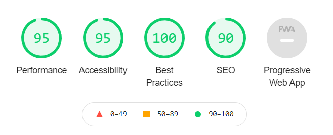

<h1 align="center">Travel Memory Website</h1>

[View the live project here.](https://tizianocoppoli.github.io/ms2-memory-game/)

This is the Travel Memory website. It is designed to be responsible and accessible on multiple devices, making it easy to navigate for players on every device.

<h2 align="center"></h2>

## User Experience (UX)

### Project Goals

The site's primary goal is to entertain the visitors and inspire them to visit multiple locations around the globe by playing a challenging memory game. It could be inserted in a travel agency website to drive more traffic as well. The site has three target audience:

- First time visitors (casual players)
- Returning visitors (people who already know the game)
- Frequent visitors (people who like the game and want to test their memory)

### Game Rules

 - There are six levels in total.
 - Each level starts with a sequence of world landmarks to memorize.
 - The difficulty is progressive.Llevel one starts with just one picture, level two with two pictures etc...
 - The user has a few seconds to memorize the sequence.
 - The user needs to match all the elements in order to proceed with the next level.
 - If the user makes a mistake, the game is over.
 - The score is calculated from 0% (game over at level one) to 100% (all answers are correct in level six).

### User stories

#### First Time Visitor Goals

1. As a First Time Visitor, I want to learn how to play quickly.
  * Upon entering the site, users are asked to press the camera image in the title screen and read the instructions.
  * The game starts easily and become more challenging after the first level.

2. As a First Time Visitor, I want to understand how long the game is.
  * In the instruction pane, it is clear that the game has six levels in total.
  * In the top part, there is an intuitive progress bar that indicates the current level.
  * In the mobile version, the progress bar is replaced with a paragraph stating the current level and the total number of levels.

3. As a First Time Visitor, I want to try to turn on the music.
  * In the lower part, there is the audio button to toggle music on/off.
  * The user can switch the music on/off anytime during the game or on the title screen.

#### Returning Visitor Goals

1. As a Returning Visitor, I want to improve my score.
  * When the user makes a mistake or beat level six the game is over and show the user his score from 0 to 100%.
  * The user can play again to make a better score.
  * If the score is less than 30%, the user will get a bronze cup, more than 30% is a silver cup, and 100% is a gold cup.

2. As a Returning Visitor, I want to send my results via mail or send to friends to show them.
  * At the end of the game, the user can insert an email address in a form to automatically send an email stating his result.
  * The user can insert the proper email address to save his result or another to share with other people.

3. As a Returning Visitor, I want to find community links.
  * At the bottom of the screen, there are the community links to visit the social pages easily.

#### Frequent User Goals

1. As a Frequent User, I want to periodically test my memory.
  * The user can test his memory periodically and see if there are improvements over time.

2. As a Frequent User, I want to be inspired by the setting and choose a location for my next trip.
  * The game provides a variety of different pictures of real-world landmark.
  * The user can be inspired by the different places and choose one of those for the next trip.

3. As a Frequent User, I want to challenge friends to see who has a better visual memory.
  * The user can share the website with friends to challenge from a distance and see who is better.
  * The user can play with friends also with just one computer in the same place. There's no need to be in different places.

### UX - Five Planes

  1. Strategy
    * The primary goal is to entertain the user with a quick memory game.
  
  2. Scope
    * Everything should be easy to understand, and the game should be quick to learn. There aren't any navigation elements, but the user should be able to activate the music anytime, replay the game and share the result with others.

  3. Structure
    * There is a title screen with a callout image to play the game. There is no need for a navbar since the only purpose is to play the game. After the title screen, there are instructions to teach the user how to play. Then the game starts with level 1 and moves further to level six. If the user makes a mistake or win each level, the ending screen appears. In the ending screen, there is the reward, the score, and the mail form to share the result. 

  4. Skeleton
    * The game wrapper is the main div containing the title screen and the game screen. The game screen is composed of a progress box, an information box, a game box, and a button box. All the elements are generated in these boxes at runtime. Check the wireframe for more details.

  5. Surface
    * The game is in flat design to look modern, easy, and fresh. The theme is travel, so the title screen feature a camera and each element to memorize in the game are pictures of world landmarks. Check the design for more details.

### Design

#### Colour Scheme

- The palette has been generated with [Coolors](https://coolors.co/)


  - English Red: #a64253
  - Deep Champagne: #f2d492
  - Medium Slate Blue: #7f7eff
  - Sky Blue Crayola: #76e5fc
  - Atomic Tangerine: #f29559
  - Black: #000000
  - White: #ffffff

#### Typography

- "Comfortaa" is the main font used throughout the whole website, with Sans Serif as the fallback font in case for any reason the font isn't being imported into the site correctly.
- "Ribeye" is a clean font used for headings.

#### Imagery
- Imagery is important. The game is in flat design. The images are without borders, and the image under the title is designed to be striking and catch the user's attention. It also has a modern, energetic aesthetic.

### Wireframes

- Desktop Wireframe - [View](assets/doc/desktop.pdf)
- Tablet Wireframe - [View](assets/doc/tablet.pdf)
- Mobile Wireframe - [View](assets/doc/mobile.pdf)

## Features

- Responsive on all device sizes
- Interactive audio control
- Six levels to play
- Button hover animations
- Modal used to choose game options
- Progress bar
- Score system
- Three possible rewards
- Send result via mail

### Features Left to Implement

- More sound effects
- Difficult selector

## Technologies Used

### Languages Used

- [HTML5](https://en.wikipedia.org/wiki/HTML5)
- [CSS3](https://en.wikipedia.org/wiki/Cascading_Style_Sheets)
- [JavaScript](https://en.wikipedia.org/wiki/JavaScript)

### Frameworks, Libraries & Programs Used

1. [Bootstrap 4.1.3:](https://getbootstrap.com/docs/4.0/getting-started/introduction/)
  - Bootstrap was used to assist with the responsiveness and styling of the website.
2. [Google Fonts:](https://fonts.google.com/)
  - Google fonts were used throughout the project.
3. [Font Awesome:](https://fontawesome.com/)
  - Font Awesome was used on all pages throughout the website to add icons for aesthetic and UX purposes.
4. [jQuery:](https://jquery.com/)
  - jQuery was used to control the audio, the animations and throughout the game code.
5. [Git](https://git-scm.com/)
  - Git was used for version control.
6. [GitHub:](https://github.com/)
  - GitHub is used to store the projects code after being pushed from Git.
7. [Paint.net:](https://www.getpaint.net/)
  - Paint.net was used to edit the game graphics and background.
8. [Balsamiq:](https://balsamiq.com/)
  - Balsamiq was used to create the during the design process.
9. [Visual Studio Code:](https://code.visualstudio.com/)
  - Visual Studio Code was used to write code, commit to Git and Push to GitHub.
10. [EmailJS:](https://www.emailjs.com/)
  - EmailJS was used to send emails to players with their results.

## Testing

The W3C Markup Validator and W3C CSS Validator Services were used to validate every page of the project to ensure there were no syntax errors in the project.

- [W3C Markup Validator](https://jigsaw.w3.org/css-validator/#validate_by_input) - [Results](assets/doc/html-valid.png)
- [W3C CSS Validator](https://jigsaw.w3.org/css-validator/#validate_by_input) - [Results](assets/doc/css-valid.png)
- [Esprima JS Validator](https://esprima.org) - [Results](assets/doc/js-valid.png)

The deployed site was tested with Lighthouse for performance evaluation and with Responsinator for responsiveness.

- [Lighthouse](https://developers.google.com/web/tools/lighthouse) - [Results](assets/doc/lighthouse.png)

  

- [Responsinator](http://www.responsinator.com/) - [Results](http://www.responsinator.com/?url=https%3A%2F%2Ftizianocoppoli.github.io%2Fms2-memory-game%2F)

### Further Testing

- The Website was tested on Google Chrome, Firefox and Microsoft Edge.
- The website was viewed on a variety of devices such as Desktop, Laptop, iPhone7, iPhone 8 & iPhoneX, iPad.
- A large amount of testing was done to ensure that all pages were linking correctly.
- The emailJS integration has been tested.

### Solved Bugs

- It wasn't possible to use a event handler with jquery to a appened element. Solved using on:

```
$("body").on("click", "#start-button", function () {
  newGame(1);
});
```

- Can't align some elements in the middle, solved with CSS:

```
#element {
    margin-right: auto;
    margin-left: auto;
}
```

## Deployment

### GitHub Pages

The project was deployed to GitHub Pages using the following steps...

1. Log in to GitHub and locate the [GitHub Repository](https://github.com/tizianocoppoli/ms2-memory-game/)
2. At the top of the Repository (not top of page), locate the "Settings" Button on the menu.
3. Scroll down the Settings page until you locate the "GitHub Pages" Section.
4. Under "Source", click the dropdown called "None" and select "Master Branch".
5. The page will automatically refresh.
6. Scroll back down through the page to locate the now published site [link](https://tizianocoppoli.github.io/ms2-memory-game/) in the "GitHub Pages" section.

### Forking the GitHub Repository

By forking the GitHub Repository we make a copy of the original repository on our GitHub account to view and/or make changes without affecting the original repository by using the following steps...

1. Log in to GitHub and locate the [GitHub Repository](https://github.com/tizianocoppoli/ms2-memory-game/)
2. At the top of the Repository (not top of page) just above the "Settings" Button on the menu, locate the "Fork" Button.
3. You should now have a copy of the original repository in your GitHub account.

### Making a Local Clone

1. Log in to GitHub and locate the [GitHub Repository](https://github.com/tizianocoppoli/ms2-memory-game/)
2. Under the repository name, click "Clone or download".
3. To clone the repository using HTTPS, under "Clone with HTTPS", copy the link.
4. Open Git Bash
5. Change the current working directory to the location where you want the cloned directory to be made.
6. Type `git clone`, and then paste the URL you copied in Step 3.

```
$ git clone https://github.com/YOUR-USERNAME/YOUR-REPOSITORY
```

7. Press Enter. Your local clone will be created.

```
$ git clone https://github.com/YOUR-USERNAME/YOUR-REPOSITORY
> Cloning into `CI-Clone`...
> remote: Counting objects: 10, done.
> remote: Compressing objects: 100% (8/8), done.
> remove: Total 10 (delta 1), reused 10 (delta 1)
> Unpacking objects: 100% (10/10), done.
```

Click [Here](https://help.github.com/en/github/creating-cloning-and-archiving-repositories/cloning-a-repository#cloning-a-repository-to-github-desktop) to retrieve pictures for some of the buttons and more detailed explanations of the above process.

## Credits

### Code

- [Bootstrap 4.1.3](https://getbootstrap.com/docs/4.0/getting-started/introduction/): Bootstrap Library used throughout the project mainly to make the site responsive using the Bootstrap Grid System.
- Code for modal taken from [Getbootstrap](https://getbootstrap.com/docs/4.0/components/modal/)

### Content

- All content was written by the developer.
- Psychological properties of colours text in the README.md was found [here](http://www.colour-affects.co.uk/psychological-properties-of-colours)

### Media

- Background Music: Folk Acoustic by [MaxKoMusic](https://maxkomusic.com/)
- Pictures and background: [Pixabay](https://pixabay.com/)
- Editing is made by the developer.

### Acknowledgements

- My Mentor for continuous helpful feedback.
- Tutor support at Code Institute for their support.
